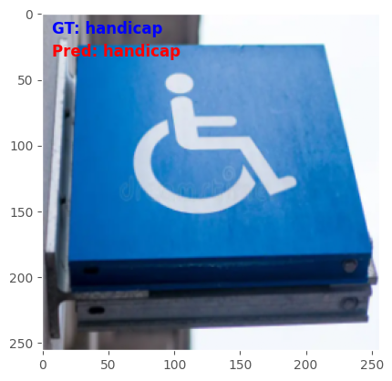

# Data Scientist

#### Technical Skills: Python, SQL, Tableau

## Education
- Data Science, Diploma | Lighthouse Labs, Canada (_November 2023_)
- Applied Mathematics, PhD | Tshwane University of Technology, Pretoria, South Africa (_November 2021_)								       		
- Mathematical Technology, MTech | Tshwane University of Technology, Pretoria, South Africa (_July 2018_)	 			        		
- Mathematics, BSc | University of Lagos, Nigeria (_October 2012_)

## Projects
### Image classification of road signs in Alberta

Transfer learning was used to retrain pretrained architectures to identify 17 classes of road signs. Custom dataset using one-shot learning was used as the problem is specific. The final layers of the EfficientNetB3, RestNet50, VGG16 architectures were tuned for training on the custom dataset and a preferred model was selected for deployment. The EfficientNetB3 model had an accuracy of $84\%$ and was preferred because it is lightweight (for deployment purposes). Since there was no imbalance in the dataset, accuracy was the metric that was focused on.

A sample of the model in action is shown below

and a prerecorded video of the deployed Streamlit web app is illustrated

<video width="640" height="300" controls>
  <source src="assets/img//streamlit-demo.mov" type="video/mp4">
</video>

The entire repo is available [here](https://github.com/samuelsurulere/image-classification-of-road-signs/).

### Twitter Sentiment Analysis

Twitter dataset was downloaded from a Twitter API (now X). The text file was in JSON format, positive and negative tweets had to be extracted using a for-loop. Preprocessing was done and data was converted using a vectorizer. The MultinomialNB, BernoulliNB, LogisticRegression, SVC, DecisionTreeClassifier,
RandomForest models were tested and the preferred model was selected based on recall and ROC-AUC curve. The hyperparameters of the model were optimized and saved for deployment using Flask library. The project is available for viewing [here](https://github.com/samuelsurulere/Sentiment-Analysis/).

### Prescriptive modeling of Los Angeles crime data

Used **Kmeans** algorithm to identify crime hotspots using crime data for Los Angeles that was downloaded from the US Government open data website. Data cleaning was done in preparation for data analytics (in Tableau) and cluster analysis (in Python). Prescriptive policing model (crime segmentation) agrees with inferences from EDA. The project is available for viewing [here](https://github.com/vangalasusmi/Mid-term-Project).

<!-- ## Work Experience
**Data Scientist @ Toyota Financial Services (_June 2022 - Present_)**
- Uncovered and corrected missing step in production data pipeline which impacted over 70% of active accounts
- Redeveloped loan originations model which resulted in 50% improvement in model performance and saving 1 million dollars in potential losses

**Data Science Consultant @ Shawhin Talebi Ventures LLC (_December 2020 - Present_)**
- Conducted data collection, processing, and analysis for novel study evaluating the impact of over 300 biometrics variables on human performance in hyper-realistic, live-fire training scenarios
- Applied unsupervised deep learning approaches to longitudinal ICU data to discover novel sepsis sub-phenotypes -->

## Talks & Presentations
- Theoretical investigation of linear solutions in nanolattices influenced by interatomic potentials - University of Calgary, Canada, Spring 2023.
- Analysis of oscillations in 1D nanostructures influenced by different concrete potential functions - ADEANS IV Conference, South Africa, Summer 2022.
- Vibrations of a growing nonlinear chain particle - ICMSA, University of South Africa, South Africa, Summer 2019.

## Selected Publications
1. Surulere, S. A.; Malange, T.; Shatalov, M. Y. & Mkolesia, A. C. Parameter estimation of potentials that are solutions of some second-order ordinary differential equation. Discontinuity, Nonlinearity and Complexity 2023, 12, 207.
2. Surulere, S. A.; Shatalov, M. Y.; Ehigie, J. O.; Adeniji, A. A. & Fedotov, I. A. Nonlinear interactions in nanolattices described by the Classical Morse, Biswas-Hamann and Modified Lennard-Jones potentials. Russian Journal of Nonlinear Dynamics 2022, 18, 183.
3. Surulere, S. A. & Oladeji, A. O. Error bounds of Trapezoidal, Simpson's rules and Gauss-Legendre quadrature rule. Australian Journal of Mathematical Analysis and Applications 2021, 18, 1.
4. Surulere, S. A.; Shatalov, M. Y.; Mkolesia, A. C. & Fedotov, I. Vibrations in a growing nonlinear chain. Discontinuity, Nonlinearity and Complexity 2021, 10, 445.
5. Surulere, S. A.; Shatalov, M. Y. & Ehigie, J. O. Analysis of oscillations in a 1D nanostructure influenced by different concrete potential functions. International Journal of Non-Linear Mechanics 2023, 148, 104307.

- [Data Science Blog](https://medium.com/@drsamuelsurulere)